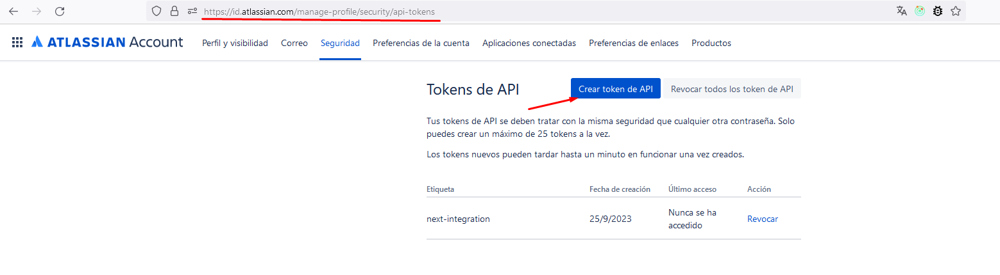
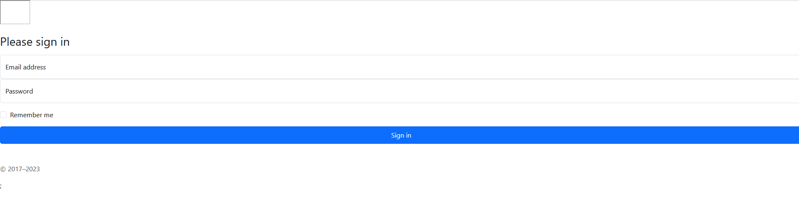
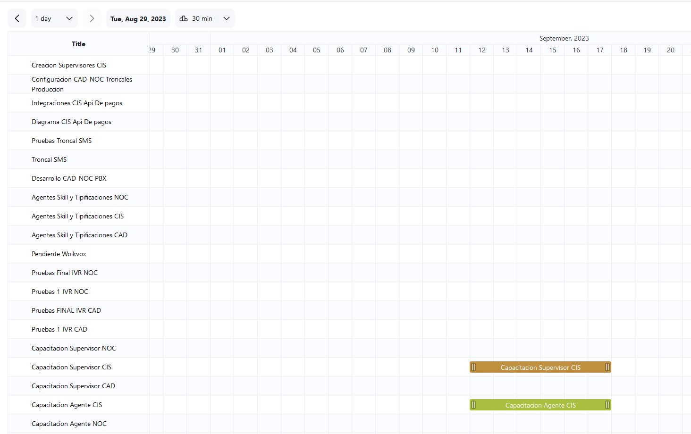

# React - Jira Integrations

A basic project with React and Jira APIs

## Steps

1. Clone Project
```
  git clone https://github.com/RBD15/next-jira-integration.git
```

2. Install packages
```
npm install
```

3. Create .env.local file into the root directory

4. Create Jira Credentials from https://id.atlassian.com/manage-profile/security/api-tokens



5. Add Jira Username and Password api project credentials
```
API_URL=https://yoururlproject.atlassian.net/rest/api/latest
JIRA_USERNAME=
JIRA_PASSWORD=
```

5. Current project uses Firebase Email Authenticantion, so we have to hosting project in Firabase and create from console authentication credentials, then set these firebaseConfig credentials into .env.local file

```
NEXT_PUBLIC_FIREBASE_API_KEY=apiKey
NEXT_PUBLIC_FIREBASE_AUTH_DOMAIN=auth_domain
NEXT_PUBLIC_FIREBASE_PROJECT_ID=projectId
NEXT_PUBLIC_FIREBASE_STORAGE_BUCKET=storage_bucket
NEXT_PUBLIC_FIREBASE_MESSAGING_SENDER_ID=messaging_sender_id
NEXT_PUBLIC_FIREBASE_APP_ID=app_id
```

## App Captures

1. Login Page



2. Gantt Diagram




## Packages:

1. Chart Gantt - References: https://github.com/el-tumakov/react-virtual-gantt-repo/tree/main  Author: Egor Tumakov